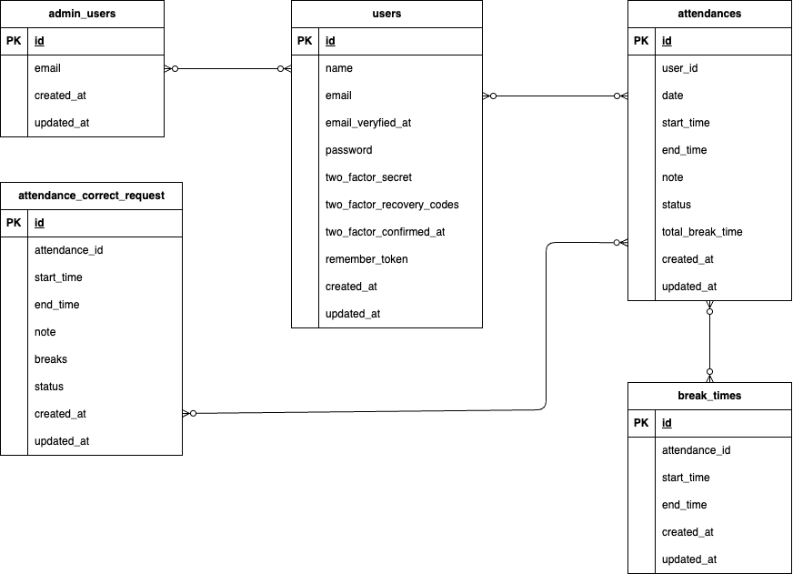

# ⌛️ Laravel 勤怠管理アプリ

このアプリは勤怠管理のアプリです。  
ユーザーは勤怠入力、閲覧、修正、承認等行うことができます。
---
## ✅ 主な機能

- ユーザー登録・ログイン（メール認証あり）
- 出勤、休憩、退勤時間の入力、記録
- 勤怠記録の閲覧
- 勤怠記録の修正、申請
- 管理者による勤怠記録の閲覧、修正、承認

---

## 🛠 環境構築手順
### 環境構築

Docker を使用して開発環境を構築しています。
docker-compose.ymlのnginx,mysqlにplatform: linux/amd64と記述しています。必要に応じて変更してください。

### 使用技術
- PHP 7.4.9 
- Laravel 8.83.29 
- MySQL 8.0.26 
- Laravvel Fortify
- MailHog

### セットアップ手順

#### ビルド＆起動
```
docker compose up -d --build
```

#### Laravelコンテナに入る
```
docker-compose exec php bash
```

#### 依存関係をインストール
```
composer install
```

#### 環境ファイルをコピー
```
cp .env.example .env
```
```
DB_CONNECTION=mysql
DB_HOST=mysql
DB_PORT=3306
DB_DATABASE=laravel_db
DB_USERNAME=laravel_user
DB_PASSWORD=laravel_pass
```
#### アプリケーションキーを生成
```
php artisan key:generate
```
#### データベースをマイグレート & シーディング
```
php artisan migrate --seed
```
---
## 📧 メール認証設定（MailHog 使用）
#### 機能概要
- 新規ユーザー登録時にメールアドレス認証必須
- 認証完了後のみログイン可能
#### MailHogの起動
```
docker run -d -p 1025:1025 -p 8025:8025 mailhog/mailhog
```
- Web UI: http://localhost:8025
- SMTPポート: 1025
#### .env設定例
```
MAIL_MAILER=smtp
MAIL_HOST=host.docker.internal
MAIL_PORT=1025
MAIL_USERNAME=null
MAIL_PASSWORD=null
MAIL_ENCRYPTION=null
MAIL_FROM_ADDRESS="noreply@example.com"
MAIL_FROM_NAME="${APP_NAME}"
```
#### テスト手順
1.	ユーザー登録
2.	MailHog Web UI http://localhost:8025 でメールを確認（ない場合は『認証メールを再送する』をクリック）
4.	認証リンクをクリックして有効化
5.	ログインが可能に
---
## 🧪 Featureテスト
#### 実行コマンド
```
php artisan test
```
#### 主なFeatureテストカバー範囲
-	ユーザー認証、ログイン・ログアウト機能（管理者、一般ユーザー）
-	ステータス確認機能（出勤中（１日一回）、休憩（１日複数回）、退勤済
-	勤怠情報の閲覧、修正
-	管理者による勤怠情報の閲覧
-	管理者による修正、承認
-	各バリデーションメッセージの表示
 ---
### ✏️ 特記事項
- クライアント様（担当コーチ）との要件確認した結果、管理者のログインについて以下のように設計しております
- ユーザー登録後、別途管理者登録を要する想定で設計（管理者ログインできるのは、管理者登録されたユーザーのみ）
- 管理者の登録機能は未実装
 --- 
### 👤 ダミーデータ情報
#### 管理者
- name:admin
- email:admin@example.com
- password:adminadmin
- 管理者登録済、メール認証済、勤怠情報前日１日分
#### 一般ユーザー
- name:staff
- email:staff@example.com
- password:staffstaff
- メール認証済、勤怠記録前日１日分

## 📸 ER 図

データベース設計の概要：



---
##URL
開発環境：http://localhost

